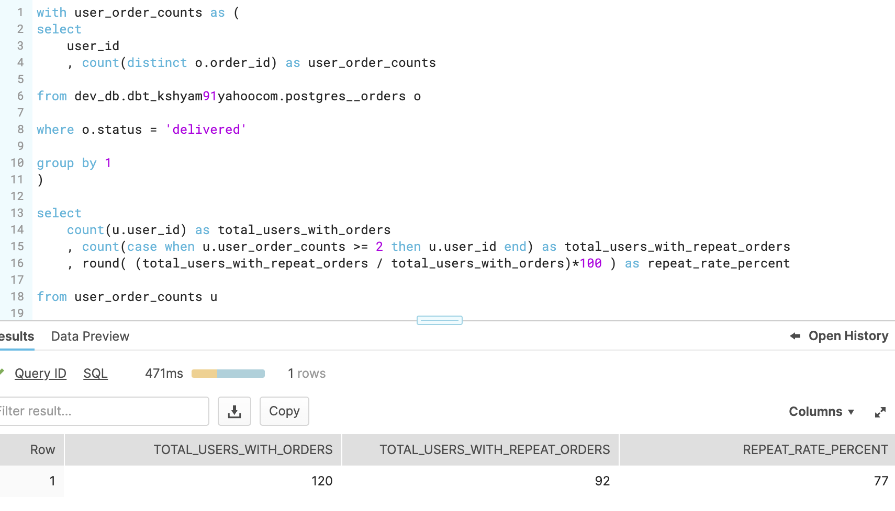
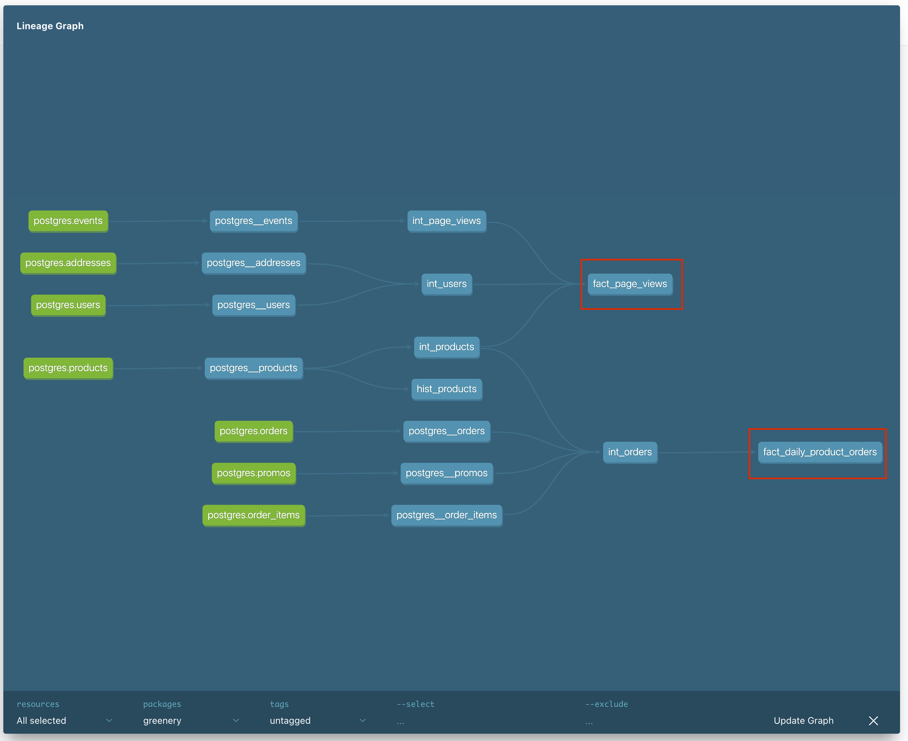
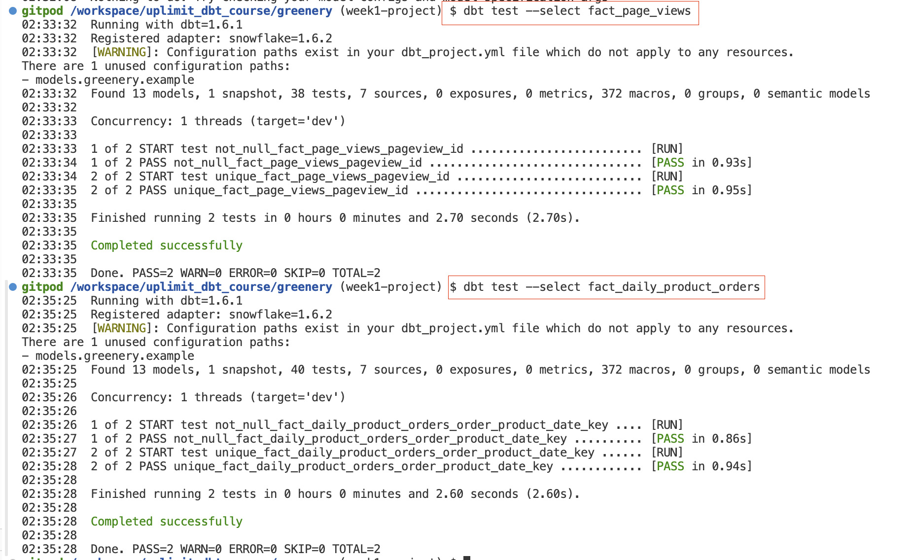
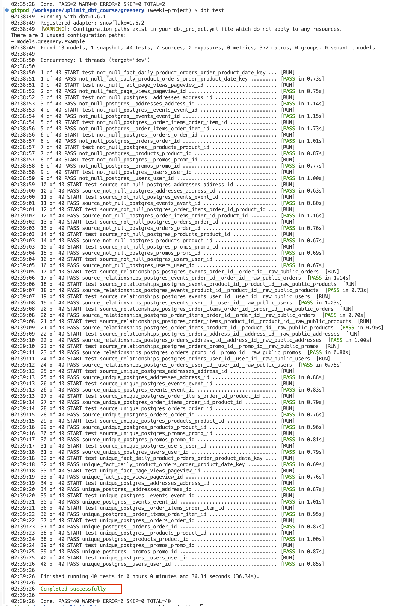
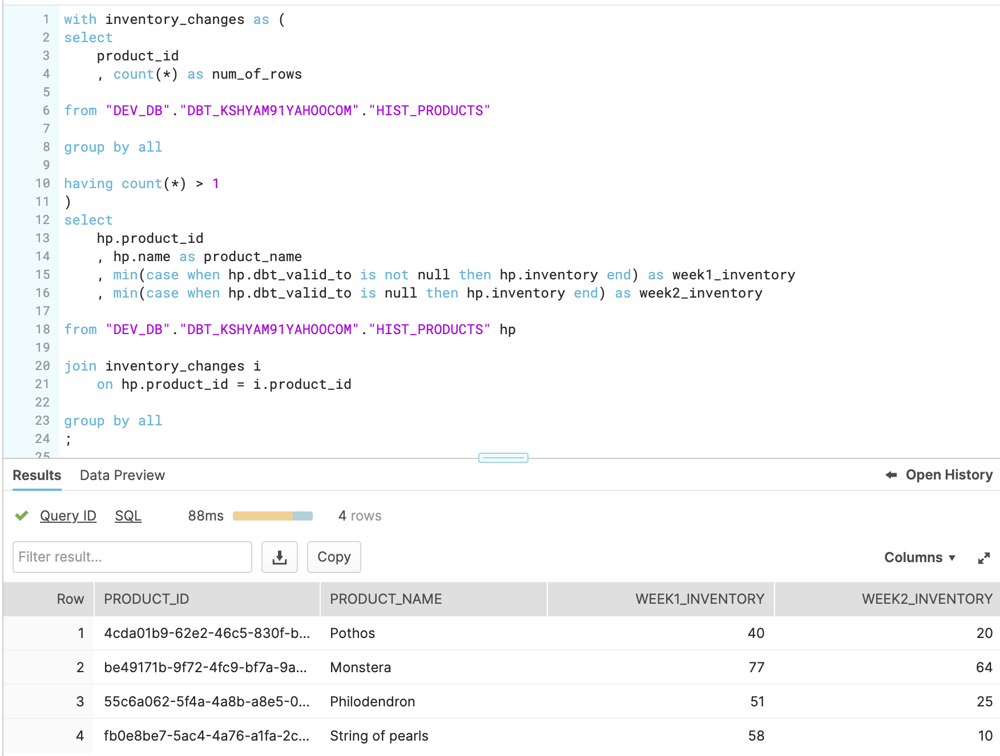
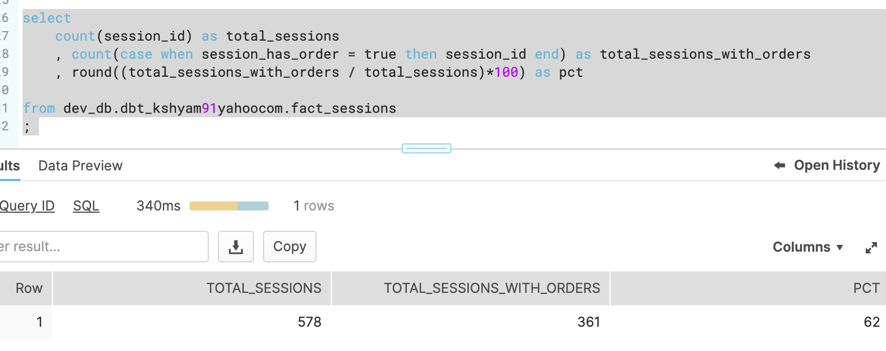
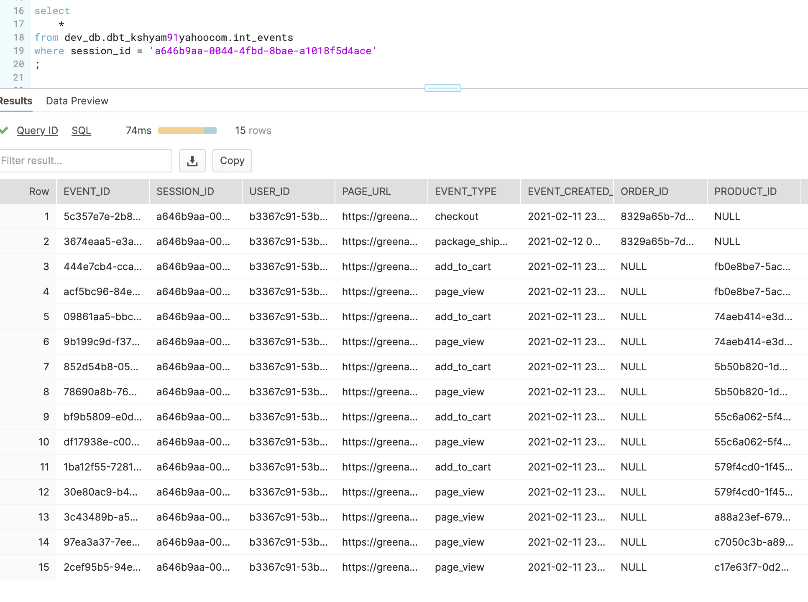
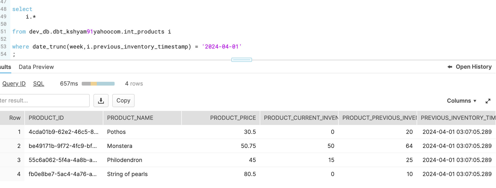

### Week 1 Queries 

1. How many users do we have?

-- All Users 
select 
    count(distinct u.user_id) as user_counts 
    
from  "DEV_DB"."DBT_KSHYAM91YAHOOCOM"."POSTGRES__USERS" u
; 
-- Users w/ orders
select 
    count(distinct o.user_id) as user_counts 
    
from  "DEV_DB"."DBT_KSHYAM91YAHOOCOM"."POSTGRES__ORDERS" o
; 

2. On average, how many orders do we receive per hour?

-- first, we count the number of orders, rolled up at the HOUR level
with tmp as (
select
    extract(hour from date_trunc(hour,o.created_at)) as created_at_hour
    , count(o.order_id) as order_counts 
    
from "DEV_DB"."DBT_KSHYAM91YAHOOCOM"."POSTGRES__ORDERS" o
  
group by 1
)

-- next, we compute the hourly average
select 
    round(avg(t.order_counts)) as avg_orders_per_hour
    
from tmp t
;

3. On average, how long does an order take from being placed to being delivered?

-- first, we calculate 'time_to_deliver' in days for every order
with tmp as (
select 
    o.* 
    , datediff(day, o.created_at, o.delivered_at) as time_to_deliver 

    
from "DEV_DB"."DBT_KSHYAM91YAHOOCOM"."POSTGRES__ORDERS" o

-- this is ONLY null for non-delivered orders
where o.delivered_at is not null 
)

select 
    round(avg(time_to_deliver),2) as avg_time_to_deliver

from tmp 

4. How many users have only made one purchase? Two purchases? Three+ purchases?
Note: you should consider a purchase to be a single order. In other words, if a user places one order for 3 products, they are considered to have made 1 purchase.

-- first, we calculate order counts per user
with tmp as (
select 
    o.user_id
    , count(o.order_id) as order_counts 
    
from "DEV_DB"."DBT_KSHYAM91YAHOOCOM"."POSTGRES__ORDERS" o

group by 1
)

-- next, we find count of users with 1,2,3+ orders
select 
    count(case when t.order_counts = 1 then t.user_id end) as users_with_only_one_order
    , count(case when t.order_counts = 2 then t.user_id end) as users_with_two_orders
    , count(case when t.order_counts >= 3 then t.user_id end) as users_with_three_plus_orders
    
from tmp t 
;

5. On average, how many unique sessions do we have per hour?
-- first, we count the number of unique sessions, rolled up at the HOUR level
with tmp as (
select
    extract(hour from date_trunc(hour,e.created_at)) as created_at_hour
    , count(distinct e.session_id) as session_counts 
    
from "DEV_DB"."DBT_KSHYAM91YAHOOCOM"."POSTGRES__EVENTS" e
  
group by 1
)

-- next, we compute the hourly average
select 
    round(avg(t.session_counts)) as avg_session_per_hour
    
from tmp t
;

### Week2 
PART 1 : MODELS
1. What is our user repeat rate?

Repeat Rate = Users who purchased 2 or more times / users who purchased

2. What are good indicators of a user who will likely purchase again? What about indicators of users who are likely NOT to purchase again? If you had more data, what features would you want to look into to answer this question?
- I'd look at the events (page views) data for users who ordered vs not to understand how far in the funnel they progressed. 
- I'd assume/hypothesise that users who progressed till checkout are highly likely to finish the order

3. Explain the product mart models you added. Why did you organize the models in the way you did?
- First, i created a marts folder with sub folders (core, marketing, product), though ONLY product has models within. 
- The product folder has 2 sub folders - intermediate & fact. All preliminary transformation models can be found within the intermediate folder & the final (fact) can be found in the fact folder 
- fact_page_views model combines page views + users & products datasets. This will help us understand page views for every product across times & users 
- fact_daily_product_orders is a simple fact table that helps us report on daily product orders 
- We can now use these 2 facts on the reporing layer & filter by a specific product to understand page views or orders over time. 

4. Use the dbt docs to visualize your model DAGs to ensure the model layers make sense. 
Please see the DAG here ! 

PART 2 : TESTS 
1. I have created 2 .yml files for the 2 facts & added a unique/not null test on the primary key. Please see test results below : 

2. I have added primary key <> foregin key tests to the staging yml/model so we should be good from an upstream data quality perspective 
3. Ran 'dbt test' on the entire project & all tests are passing !! 

4. Real time alerts : We gotta link our dbt notifications to slack so that we can get real time notifications on test failures. I believe if we use dbt core, we would get notifications via email. 

PART 2 : SNAPSHOTS
- Which products had their inventory change from week 1 to week 2? 
Please see query/output below ! 

### Week3 

Part 1 
1. What is our overall conversion rate?

2. What is our conversion rate by product?
Not sure what's the expected calculation / outcome here as i see in the events data, for those rows where product_id is populated there is no corresponding order_id so not sure how we know if a product related event ended up in an order. 

Part 2 : Macros
Create a macro to simplify part of a model(s).
Please see 'distinct_event_counts_per_event_type' macro that's being used in 'fact_session'

Part 3 : Post hook / grants 
Please check  greenery/dbt_project.yml for grants

Part 4 : Packages 
Please 'packages.yml' where i have 2 packages installed, dbt_utils & dbt_expectations. See below corresponding usage : 
- dbt_utils.generate_surrogate_key from dbt_utils to generate an unique key in postgres__order_items
- Column additions to events source data : dbt_expectations.expect_table_column_count_to_be_between

Part 5 : Show (using dbt docs and the model DAGs) how you have simplified or improved a DAG using macros and/or dbt packages.
See above comments 

Part 6 : Dbt Snapshots 
Products that had inventory changes from week 2 > week 3 
